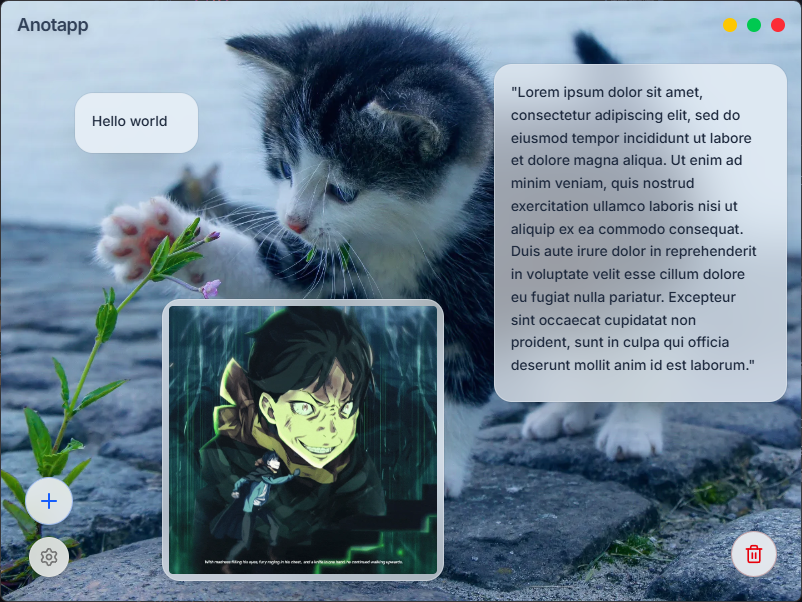

<p align="center">
  
</p>

<h1 align="center">Anotapp</h1>

<p align="center">
  Gestor de portapapeles visual y organizado para escritorio construido con Tauri y Svelte.
</p>

<p align="center">
  <a href="https://github.com/PaoloESAN/anotapp/releases/latest/download/Anotapp.exe">
    
  </a>
</p>

---

## Descripción

Anotapp es una herramienta que captura automáticamente el historial del portapapeles y los presenta como tarjetas interactivas en un lienzo infinito. Permite organizar extractos de texto e imagenes de forma visual, con capacidades de redimensionamiento, personalizacion y edición.

## Capturas de pantalla

<p align="center">
  
</p>

## Caracteristicas

- **Captura automática:** Monitorización nativa del portapapeles en tiempo real (texto e imágenes) mediante eventos del sistema operativo, sin polling.
- Interfaz interactiva: Tarjetas que se pueden arrastrar, redimensionar y organizar libremente por capas.
- Edicion de contenido: Capacidad de modificar textos y renombrar titulos de tarjetas mediante doble clic.
- Personalizacion de interfaz: Seleccion de colores primarios y soporte para temas claro, oscuro y sincronización con el sistema.
- Fondos de lienzo: Diferentes patrones visuales (cuadricula, puntos, ondas) o seleccion de una imagen personalizada con optimizacion automatica.
- Ventana minimalista: Diseño sin bordes con controles personalizados estilo macOS.
- Persistencia local: Todos tus elementos y configuraciones se guardan automaticamente en el almacenamiento local.

## Tecnologias utilizadas

- [Tauri v2](https://v2.tauri.app/)
- [Svelte 5](https://svelte.dev/)
- [TailwindCSS](https://tailwindcss.com/)
- [Shadcn Svelte](https://www.shadcn-svelte.com/)
- [Lucide Icons](https://lucide.dev/)
- [tauri-plugin-clipboard](https://github.com/CrossCopy/tauri-plugin-clipboard)

## Instalacion y Desarrollo

Para ejecutar este proyecto de forma local, **asegúrate de tener instalado Rust y Node.js.**

1. Clonar el repositorio:
```bash
git clone https://github.com/tu-usuario/anotapp.git
```

2. Instalar las dependencias:
```bash
npm install
```

3. Ejecutar en modo desarrollo:
```bash
npx tauri dev
```

## Licencia

Este proyecto esta bajo la Licencia MIT.
